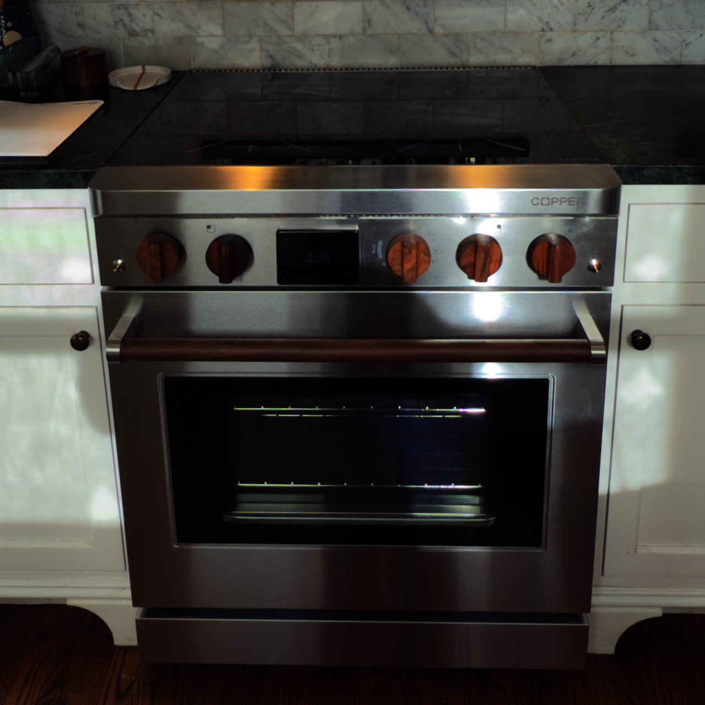
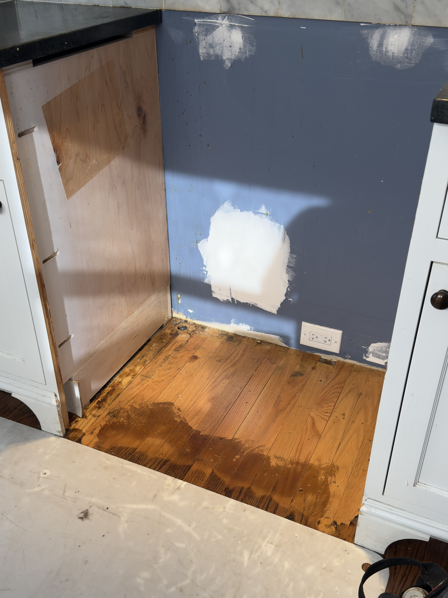
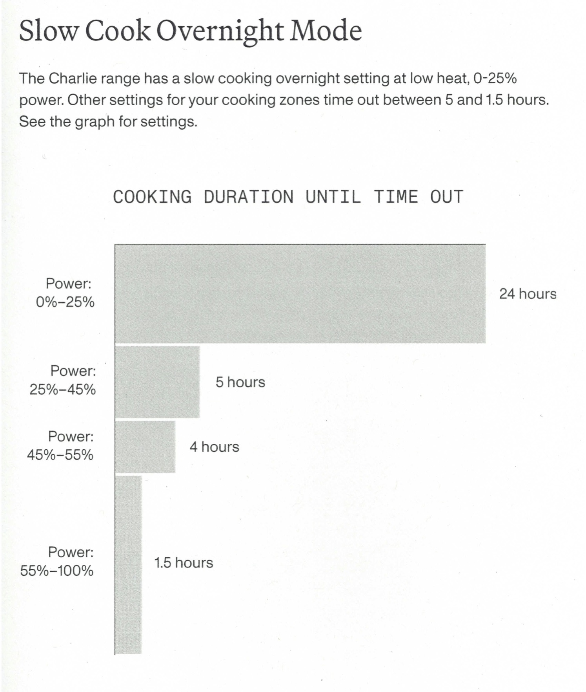

Yesterday, a team came to the house and swapped our old gas-powered range for [Copper’s Charlie](https://copperhome.com/products/charlie), a battery-powered induction range. Before placing the pre-order, I had a lot of questions that I couldn’t find answers to. The [product page](https://copperhome.com/products/charlie) on their website only lists basic specs but does not dive into how the stove works at all. This is in stark contrast to the product introductions we made at Nest, which went into extreme detail about what it is like to have a Nest Learning Thermostat on your wall. You can see a snapshot of the original website on the [Internet Archive’s Wayback Machine](https://web.archive.org/web/20120120031959/http://www.nest.com/living-with-nest/); the site still looks good today.

This is a write-up about the experience of ownership of Charlie on day one so others considering the range have more information to go on. I will likely have way more thoughts after a few weeks of use as I am still getting a feel for induction after coming from a lifetime of cooking with gas.
Delivery & Installation

### Delivery & Install

I am going to skip over the drama that was scheduling my delivery. Between the end-of-the-year holiday, being one of the first batches being sent to paying customers, and a scheduling agent who was not on top of things, it took a while to get an appointment. This is normal startup pain. We ran into similar issues with professional installation of thermostats at Nest. Hopefully, Copper will figure out the logistics of delivering and installing a nearly 200-kilogram (400-pound) appliance, but if you are also an early adopter, please be patient with the team. This isn’t like buying from a big-box retailer yet.

The installation, on the other hand, was top-notch. A team of two was dispatched to the house. The first order of business was to remove the old gas range, in my case, a 30” Platinum Series BlueStar that I have used and abused daily for the last decade or so. A quick check of the doorways with the tape measure and a set of lift straps, and they were able to get it out to the garage seemingly effortlessly. I will clean up the gas range and sell it to someone insistent on gas, thus avoiding the purchase of yet another new gas range.

After removing the old range, the first thing the installation team noticed was that the gas line needed to go as the range does not have enough room for it. Thankfully, I have easy access underneath the kitchen, and they were able to cap the line just below the floor. I have already contacted PG&E to turn off the gas as this was our last gas appliance. I was told by the installers that many gas lines come into the cabinet next to the range for easy access to the shut-off, so most installs wouldn’t require capping the old line.

Then the new stove was brought in and slid into place. The knobs and oven handle were installed onsite, and there was some adjustment of the legs to make it level with the counter. I was asked to download the app, pair via Bluetooth, and was given a quick demonstration of the functionality of the range, which oddly enough uses almost exactly the same interface as the old BlueStar. Soon I will be cooking with clean electrons from our solar panels.

### The Manual

Appliance manuals are dry; there isn’t much getting around that. They have to convey both safety and functionality information in an unambiguous way that will be clear to the original owner and the person who buys the house a generation later. Copper did an excellent job here. The manual is printed in black and on high-quality paper with clear icons and useful charts.

Also included is a full-color spiral-bound book titled “Meet Charlie: A Culinary Guide”. This includes a quick introduction to induction on the cooktop and convection for the oven, and some simple recipes. The biggest omission with the recipes is the use of phrases like “Preheat the pan to medium-high on the cooktop.” OK, checking the chart labeled “Power Settings” in the manual, medium-high heat is between 55 and 75% power. For both new cooks and those new to induction, the recipes could include that information; after all, one of the benefits of induction cooking is precision.

Like any tool, the manuals are meant to be read, and these are short and to the point, filled with lots of detail about operation. I wish the guide had more of the information re-printed from the manual, but overall, I have no complaints about the quality of the information presented. 

### The Cooktop

The cooktop is divided into two linked zones, divided down the middle. Each induction burner has its own control knob; in my case, I opted for the California Black Walnut knobs, but Inkwell Polymer Black knobs are also available. The knobs allow adjustment of the burners in 5% increments with a Power Boost Mode at the high end.

While adjusting the knobs, the LED display on the front panel shows what percentage power is being sent to the burner, with a red LED power bar on the outside of each burner that shows its current power level whenever it is on. If a burner is turned all the way to Power Boost, the red LEDs shimmer to indicate this mode, and only one burner in each linked zone can be in Power Boost Mode at a time. Power Boost works for up to 5 minutes, then automatically reverts to the 100% power setting.

I still don’t know why they are called “linked zones” as there does not seem to be a way to “link” the front and back burner for a griddle, but the two-burner cast iron griddle from my gas stove works great with two independently controlled cooking zones. This is what I usually want when cooking anyway, so perfect.

On the smaller scale, the smallest pan size Charlie can detect is 80mm (3⅛ inches), so my stainless Moka pot (100mm) is detected perfectly, and I can make an afternoon cup easily.

I regularly make popcorn as a snack. Previously, I used the standard aluminum WhirlyPop. It works great on gas and standard electric, but I upgraded to the stainless steel version for induction. This seemed to work fine, but I burned my first batch as it was popping— a good sign as the gas stove took a while to heat the kernels before popping. I’ll need to adjust my technique, but rapid heating is the name of the game when it comes to perfectly popped popcorn. I’ll just need to adjust my technique for the new tool, but it should pop even faster with less waiting.

I have noticed some high-pitched noises from my pans; some could be low-quality cookware, but all were noticeably less than my portable induction cooktop. This will need some exploration to reduce those noises. Thankfully, they don’t carry far and don’t disturb the dogs or others in the house.

One thing I make regularly is chicken stock. Chicken stock requires keeping a large pot of water just below boiling for many hours. While this can be achieved in a Crock-Pot, I have a small kitchen and normally use the simmer burner on our previous range to keep the stock just around boiling for many hours. With Charlie, the idea is to use the battery to keep from pulling more than a standard US outlet can deliver. This means you are limited to that battery for long cooks. How limited? Well, according to the chart in the manual, it can maintain a burner at up to 20% output for 24 hours. I currently have a stock pot on a back burner at 20% power, and the stock is a perfect 92°C (198°F). If I needed a 24-hour slow cook for some reason, this could handle it just fine. Higher temperature cooks are by definition quicker, so need for a long duration of power is not really a thing.

The battery information is not displayed on the LED display normally. According to the manual, it is only shown when there is an issue, including when the power is out. This makes sense as I rarely think of the batteries in my devices once I have learned to properly charge them and, being plugged in all the time, the range takes care of charging. During a power outage, it will still allow basic cooking when needed. The battery pack is a lithium iron phosphate, the same type of battery used in standard range Tesla Model 3s, but at a smaller 5.3kWh capacity.

### The Oven

The temperature is controlled by a single knob that goes from 80ºF to 550ºF, followed by a broil setting. The knob moves in 5-10° increments (does not seem to be consistent), and the readout is only in Fahrenheit, with no way to change the preferred scale.

On the left is a toggle switch (just like the old BlueStar) for the oven light, and on the right another for the fan (aka convection, air fryer, etc., also just like BlueStar). Both can be tapped up or down to turn on their feature and tapped again to turn off. In both cases, I would prefer the feature to turn off automatically after a bit of time (for the light) or when the oven is turned off (for the fan), but they seem to stay on indefinitely.

Being electric, the oven seems to be very accurate, unlike my gas oven, which could fluctuate as much as 50° (F or C, approximate) during a cook. Electric elements can turn off and on more rapidly and maintain a more constant temperature.

The manual has basically no information about the oven, which is unfortunate. Being able to maintain a temperature as low as 80ºF means it is perfect for proofing bread, dehydrating food, and, if the temperature is accurate enough, sous vide. All things that are poorly implemented in more software-rich ovens and single-use appliances.

### The Smarts
If you haven’t figured it out by now, my hobby is cooking, and my vocation has traditionally been in the Smart Home industry. This range has the ability to connect to WiFi and Bluetooth, which sets the time automatically and gets regular firmware updates. For most people, that should be enough, but not people like me. As anyone who has worked for me knows, I am lazy. Not that I don’t like to do work, but that I really don’t like to do work that can be automated. As a software engineer, that is a wonderful trait. I will automate the minutiae of my day and focus more on the creative tasks; cooking is no different.

#### Cast Iron & Carbon Steel Pans
In the past, I would use my gas stove to quickly dry my cast iron and carbon steel pans. This works great as I can turn the burner on high and go back to cleaning until I smelled the pan, turn off the burner, and turn on the fan, and it will cool over time, ready for the next cook.

With my portable induction cooktop, I would place the pan on the burner, turn it on (defaults to 50%), and set the built-in timer to 4 minutes. It would heat up enough to dry the pan and then automatically shut off.

With Charlie, there is no way to auto-dry carbon steel or cast iron pans. I can use the same method as the gas cooktop, but frankly, I want a touchscreen interface to just select a burner and say “dry pan”. The built-in temperature sensor should detect the dry state (pan is over 100ºC) and auto-turn off.

#### Rice
Rice cookers operate on a simple principle. When the cook plate overshoots the temperature of boiling water, the rice is done. Having a rice feature that heats a pot until it hits boiling temperature and then turns off would eliminate the need for this appliance.

#### App
The app is basic. It doesn’t even display the serial number (only otherwise available on the back of the unit or in a provided card), and even when a unit is paired, it only shows the add unit button.

In the future, I hope they add support for Matter cooktop status. Just let me know if I left the stove on.

Next, for existing ranges, like mine, that won’t support touchscreen controls, give me the options for drying pans and rice cooking. But ideally, these should be one-touch options on the control screen. Maybe there is a way to add a simple gesture to the knobs to indicate drying. Rice is less common and can stay in the app.

If we can calebrate pans, there are plenty of other temperature based features that could be added, including:
- Drinks (tea, coffee, cocoa)
- Candy
- Yogurt
- Griddles (pancakes, crepes, eggs)
- Irons (waffle or pizzelle)
- Sous Vide (stovetop or oven)
- Popcorn (with induction-powered stirrer)
- Risotto (with induction-powered stirrer)

Ideally, everything that I can do in the app should be available on the touchscreen with a very simple interface. I don't want pre-packaged crap in my stove, so no TV dinners or the like, just well documented and implemented automation so I can focus on my family or dinner guests.

### Repairs

### The Specs

- operating temp: 5C to 50C
- storage temp: 5C to 50C
- battery: Rechargable Lithium Ion Phosphate
  - rating: 208VDC, 28.8Ah (5366.4Wh)
  - internal cells: LIfePO4, 26700 size
  - cell configuration: 65S6p
- weight: 59.5.kg
- size: 586×550×132mm
- model: ZE23182
- certifications: [UL1973](https://www.tuvsud.com/en-us/services/testing/energy-storage/ul-1973), [UN38.3](https://unece.org/fileadmin/DAM/trans/danger/publi/manual/Manual%20Rev5%20Section%2038-3.pdf), [UL9540A](https://www.ul.com/services/ul-9540a-test-method)
