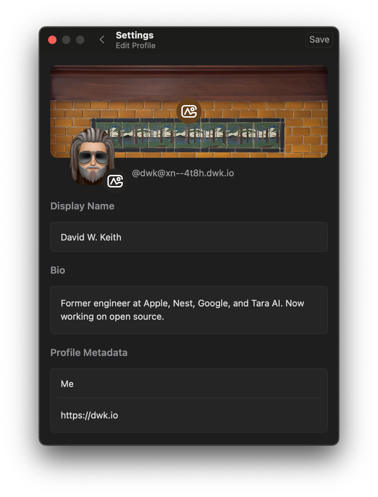

It has been well over a decade since I first started playing around with [emoji domains](/unicode-chicken-dot-tk/ "Unicode Chicken Dot TK — Pullets Forever") and in that time I have learned nothing.

First, some background. I decided to move my Mastodon account from `@dwk@mastodon.social` to my own domain. Like many wise people, I didn't want to run my own server. Been there done that. So I decided to setup a managed server with [mastohost](https://masto.host "Masto.host — Managed Mastodon Hosting"). Great pricing for my needs, and me and any future bot accounts I create can live on the domain of my choosing.

Out of all the domains I own, my first choice was to use [dwk.io](https://dwk.io "dwk.io"), my `rel=me` domain. But hosting a Mastodon instance requires the web interface to be on HTTPS port 443, and the same domain as the accounts, no subdomain, but I am using that domain for my idenity by building a static [11ty](https://www.11ty.dev "Eleventy Static Site Generator") website there. So that was a non-starter unless I determined all the paths I really needed to proxy. Not something I cared to figure out at the moment.

So then an evil thought came into my head. I could use my old [🐔.tk](https://🐔.tk "🐔.tk") domain. I would be `@dwk@🐔.tk`, a fun nod to my old `@pulletsforever` on Twitter, which I chose because all versions of my name were already in use by the time I went there. This was evil because I know that emoji domains tend to break things, especially in domain names.

As anyone who waches the news on domain registrars knows, Freenom, the authority on dot tk domains is [basically nonfunctional after a lawsuit in favor of Meta](https://www.reddit.com/r/freenom/comments/15552kp/the_end_of_an_era/ "The End of an Era — r/freenom"). This means that I can't update my records on that domain. Since Freenom didn't notify anyone of the shutdown, including paid customers, I was completely unaware until days after editing my DNS records. Back to the drawing board.

My next shortest domain is `dwk.io`. I initially thought would use something pedestrian like `m.dwk.io`. Short, sweet, functional. But emoji domains are cooler. And Cloudflare lets one use emojii as a subdomain. Hmm…

A quick history on emoji in domains. They have been around since 2001 when [☮️.com](https://☮️.com "☮️.com — First Emoji Domain") was first registered. Then in 2011 Panic Software purchased [💩.la](https://💩.la "💩.la — Panic Software"), which had a viral moment at the time. That caused me to explore [🐔.tk](https://🐔.tk "🐔.tk"). A lot more has been written about emoji domains at [i❤.ws](https://i❤.ws "i❤.ws — Emoji Domain Info"), but what is most important is [ICANN](https://www.icann.org "ICANN — Internet Corporation for Assigned Names and Numbers") has wisely advised TLDs to [reject emoji domains on security grounds](https://www.icann.org/en/system/files/files/idn-emojis-domain-names-13feb19-en.pdf "IDN Emoji Domain Names — ICANN"). That being said, ICANN can't regulate which [Punycode domains](https://en.wikipedia.org/wiki/Punycode "Punycode — Wikipedia") are allowed in subdomains. As long as the sub-domains follow the guidelines on ASCII characters, they are valid domains.

My next step, as is often the case, is to look for a valid emoji for my cause. I ended up choosing `pager` (📟) since SMS pagers were the oldest devices able to access the orginial twitter.com and Mastodon is Twitter's logical replacment.

I setup a [mastohost](https://masto.host "Masto.host — Managed Mastodon Hosting") instance at `📟.dwk.io` and followed [these instructions](https://fedi.tips/transferring-your-mastodon-account-to-another-server/ "Transferring Your Mastodon Account — Fedi.Tips") for moving my account. All was good until [Tapbots Ivory](https://tapbots.com/ivory/ "Ivory for Mastodon — Tapbots") complained I was no longer authorized. This made sense as I had migrated my account, I assumed I just need to update the server being used. Clicked over to the app and entered `📟.dwk.io` as the new server name and I couldn't click "Continue". Damn.

Ok, I can undersand their reasoning, my first thought was to setup a redirect poing `m.dwk.io` at the emoji version. I gernerally hate single letter domains, they convey little information about their purpose and are as bad as single letter variable names in code. But having a shortcut that was easy to type is not bad. This did not work. I got a mesage that the server was not responding as expcected. Apparerntly Ivory does not support HTTPS redirects

Maybe they do and are rejecting domains that inculde the punycode string `xn--`, that would be bad, as most are valid ICANN domains. Maybe they have a list of all emojii that maps to punycode, better, but now they are violating the lack of ICANN rules for subdomains. Maybe they just don't translate unicode to punycode.

The last idea seems to be true, as I now own the beautiful handle of [`@dwk@xn--4t8h.dwk.io`](https://📟.dwk.io/@dwk "DWK on Mastodon") in Ivory.

#### Update

Looks like the root cause of Apple OSes not detecting emoji domains is [rdar://6923664](http://openradar.appspot.com/6923664 "Radar 6923664 — Open Radar")
