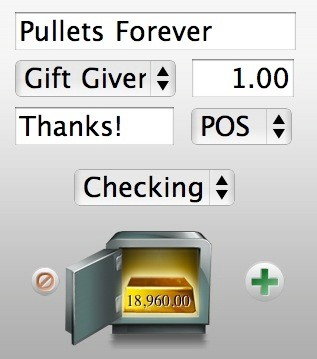
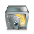

**UPDATE:** IGG Software has released [iBank Mobile](http://www.iggsoftware.com/ibankmobile/ "iBank Mobile — IGG Software") for the iPhone. It can be purchased through [iTunes](http://itunes.apple.com/WebObjects/MZStore.woa/wa/viewSoftware?id=318802616&mt=8 "iBank Mobile — App Store").

iBank.tapp automatically links to the last open iBank file and pulls in the appropriate categories transaction types and accounts. If iBank is already open on your Mac it will default to the currently selected account.

Once loaded just enter the Payee, Category and Amount and iBank will automatically create a new transaction of type POS for today’s date. (You are remembering to enter your receipts right a way, right?)

Tap on the vault icon to see your balance for the currently selected account.

iBank.tapp.zip (1.1.3)

Requirements:

* [telekinesis iPhone Remote](http://code.google.com/p/telekinesis/ "Telekinesis iPhone Remote — Google Code")

* [iBank 2.3.13](http://www.iggsoftware.com/ibank/downloads.php "iBank Downloads — IGG Software")
