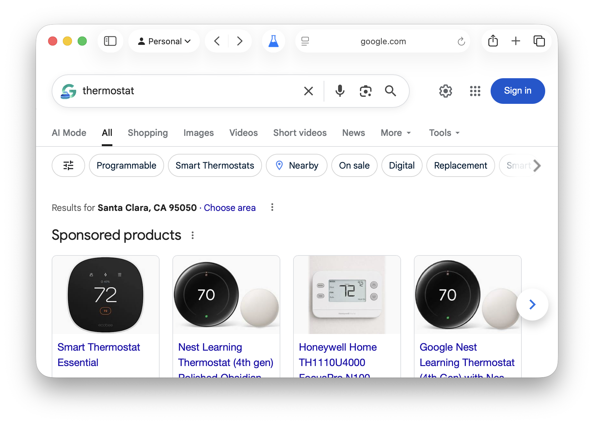
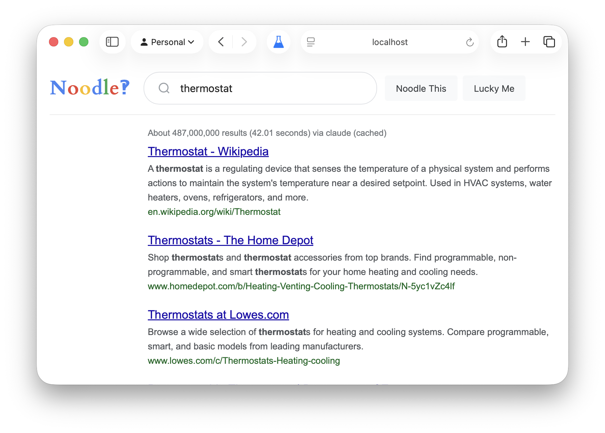

I built a search engine that shows *results*. Not to compete with Google—I definitely can't—but because somewhere between "Don't be evil" and "maximize shareholder value," Google forgot how to search. The [enshittification](https://bookshop.org/p/books/enshittification-why-everything-suddenly-got-worse-and-what-to-do-about-it-cory-doctorow/d3f8483b158906ce) is real.

Modern search is optimized for ad revenue, not answers. Every query returns a wall of SEO spam, affiliate links, and AI-generated slop that somehow ranks above the actual thing you're looking for. I wanted something that just returned results ranked by how well they answer the question. No ads. No sponsored content. Just results.

So I vibe coded [Noodle](https://gitlab.com/dwk-io/noodle) with Claude. Its a self-hosted search engine that uses the `claude` command line tool to search the web and rank results. It looks like Google back when PageRank actually meant something—sparse, familiar, ten blue links—because that's what worked.


You run the server, you own the interface. No tracking pixels. No personalization. No "People also ask" boxes that push results below the fold. You install it with npm, point it at Claude (or OpenAI), and Noodle handles the rest. Each search gets sent to the LLM with web search enabled, which applies some basic ranking criteria: relevance to query intent, source authority, content quality, recency when it matters. Results that are primarily ads or affiliate content get filtered out. Everything gets cached for six hours so you're not burning API credits on repeated searches.

```bash
npx @dwk/noodle
```

On first run it asks which provider you want (Claude CLI or OpenAI), and what port to use. Then you open localhost:3000 and search. There's even a "Lucky Me" button that jumps straight to the top result, back when "I'm Feeling Lucky" wasn't a joke.

<figure>
  
    <picture slot="first"></picture>
    <picture slot="second"></picture>
  </img-comparison-slider>
  <figcaption>Google (left) vs Noodle (right) for "thermostat"</figcaption>
</figure>

The best part is adding it as your default search engine. Chrome, Edge, and Brave let you right-click the URL bar and add it directly. Firefox requires a couple more clicks through settings. Safari, predictably, doesn't support custom search engines at all without third-party tools.

Is it better than Google? Sometimes. It's definitely slower—each search takes a few seconds while the LLM does its thing. But the results are consistently more relevant, especially for technical queries where SEO spam has completely taken over. No sponsored products, no AI overviews—just answers. And yes, there's some irony in using AI to filter out AI-generated slop—but at least this AI is working for me, not an ad algorithm.

The code is on [GitLab](https://gitlab.com/dwk-io/noodle) if you want to try it. No guestbook, but PRs welcome.
