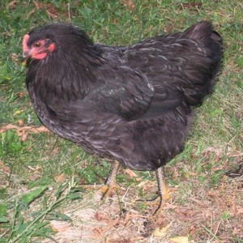

One evening in the fall I got a call from my neighbor: There was a dog eating my chickens and keeping her on the back porch. She wanted to know if she should call the sheriff, I said yes and ran to the back yard to investigate. I found two dogs one eating and one just running around in the coop. The guilty one ran, the other stayed in the coop. When the sheriff arrived he offered to shoot the dog. I asked that we just find the owner and warn them not to let their dog loose again. Asking around we found the owner was the son of a city council member. I did not press charges and she payed me the value of the pullets. I thought the issue had been resolved…
