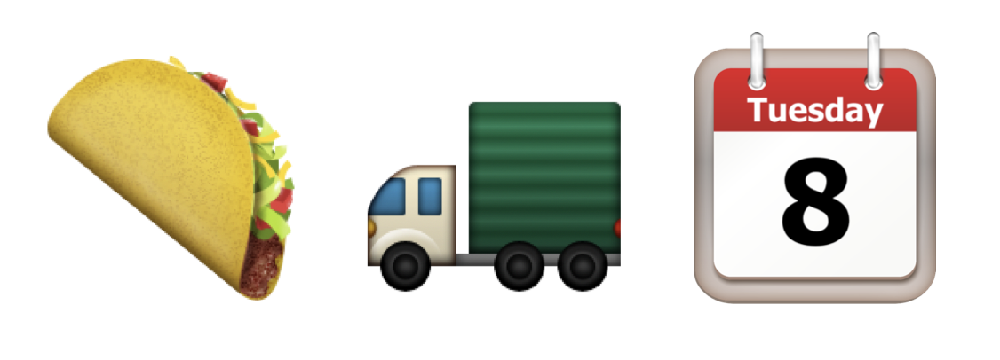

Last night Latinos for Trump founder Marco Gutierrez warned of “taco trucks on every corner” if Hillary Clinton were to be elected. Twitter is full of taco loving people, who think this a great idea.

That got me thinking: [Taco Tuesday](https://www.google.com/search?q=Taco+Tuesday) is a thing. We vote on a [Tuesday](https://en.wikipedia.org/wiki/Election_Day_(United_States)). Food trucks are [all the rage](http://www.npr.org/sections/thesalt/2015/11/11/451228595/americas-food-truck-craze-parks-on-the-streets-of-kolkata). Many people vote [around meal times](https://www.quora.com/In-the-US-when-is-the-best-time-of-day-to-vote-to-minimize-your-wait-time-in-line) but need to be at work or home shortly afterwards. Sometimes people don’t vote because they can’t find the time, they need to feed the kids or themselves.

What if we got all the food trucks, carts, and other street vendors in America to set up in front of their local polling place on November 8th? Not as political statement, but as a genuine celebration of the diversity and entrepreneurial spirit of our country. It would help people short on time as they could grab a bite when they vote. It would encourage people to mingle with their neighbors while voting. It would send extra cash toward small businesses. It might even remind people to vote when they head out to their favorite truck and see all the “Vote Here” signs.

To make this happen, I set up [tacotrucktuesday.org](http://tacotrucktuesday.org), which we can use to help organize the effort. We want to spread the trucks out so everyone has a chance to grab a bite. I am going to need some help to get the word out. We need some way of allowing vendors to claim a polling place, better designs, printed materials, signs, and maybe some legal support to help identify where trucks can setup. If you want to participate, head over the [GitHub issues page](https://github.com/tacotrucktuesday/tacotrucktueday.github.io/issues) and see what tasks need to be done. Or just follow our [Facebook Page](https://facebook.com/tacotrucktuesdayorg) or the Twitter hash tag [#TacoTruckTuesday](https://twitter.com/search?q=%23tacotrucktuesday) to follow the movement.

Finally, if you are in or around Birmingham, Alabama, please check out the improv group [Taco Truck Tuesday](https://www.facebook.com/TacoTruckTuesday/). If their performances are half as good as their name, it will be well worth your time.

🇺🇸
