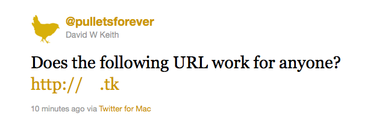

A few weeks back Panic registered Poopla (http://💩.la), what is believed to be The World’s First Emoji Domain. Outstanding! Ever since, and despite, reading John Gruber’s Star-Struck post I wanted my own iconic domain name. That day I registered:

[http://🐔.tk](http://xn--co8h.tk)

Not exactly my iconic chicken, Ginger, but nothing a custom font couldn’t solve if I really wanted to be OCD about it. The process of registering was quite simple, I went to [dot.tk](http://www.dot.tk/) where you can register a free domain name for up to 12 months by logging in with one of the many OpenID accounts available. Being the my first experience I setup the domain as a free domain. After seeing easy it was to configure and manage domain names directly with `.tk`, I decided to register directly with them.

The next step was to configure Apache so this would be an alias for pulletsforever.com. While there are many things Apache does well, handling non-ASCII characters in the configuration files is not one of them. When the IDN ([RCC-5890](http://tools.ietf.org/html/rfc5890)) standard was introduced, they wisely introduced the Punycode algorithm for translating ASCII into full Unicode. This means that in my Apache configuration, and in many other situations, the URL is represented as [http://xn--co8h.tk](http://xn--co8h.tk).

Beautiful, because as it happens, that is how I need to write it for most social networking clients to be able to handle the URL. To start with, if you are using Safari under Lion you will see:

My first thought was that this will work in all Lion browsers, as emoji is just a unicode font in Lion. Then I saw Chrome:

Firefox was not much better:

Since social networking clients all have different levels of support for Unicode, the I found that posting the link in it’s raw form of ‘http://🐔.tk’ resulted in varying link identification. Twitter saw this as a valid URL, but many clients reported it as ‘http://xn--co8h.tk' or ‘http:// .tk’. However via Twitter the link seemed to work all the time. On Facebook the link showed on my wall as ‘http://🐔.tk’ but was not clickable as a link. On Google+ it was reported as an invalid link while composing my message, and thus not clickable when the message was posted.

Despite all this I have decided to use the new URL as my shortlink url. [http://xn--co8h.tk](http://xn--co8h.tk) is shorter than https://pulletsforever.com and no more obscure than a [http://bit.ly](http://bit.ly) shortlink. On Twitter I can use the pretty emoji icon and those who can see it will get all the benefit, while those that cannot will see a random shortlink as usual, unless the Twitter client expands shortlinks, in which case the user will see the full URL for Pullets Forever. On Facebook and Google+ I don’t do much in the way of posting my links to my rarely updated blog, and if I did, they allow slightly more than 140 characters, so this is not a huge issue to me.
